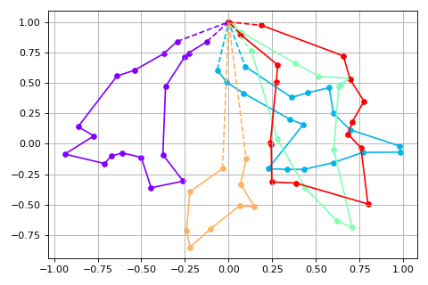
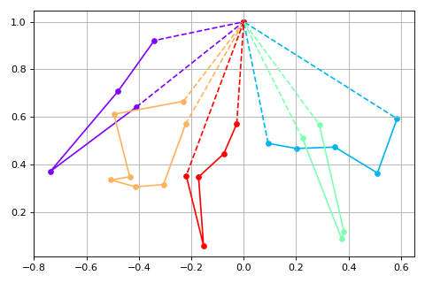

# Dynamic Insertion

This repository contains the Python implementation of the various heuristic methods described in the paper: ["A Sum-of-Squares Heuristic for a Dynamic Vehicle Routing Problem"](https://www.lancaster.ac.uk/staff/letchfoa/articles/dynamic-insertion.pdf).

## Dataset

The `dataset` folder includes a sample of 8 problem instances. The table below provides a summary of the characteristics of each instance and the number of customers served using the SoS insertion algorithm:

| Instance         | m   | D   | DL  | SoS |
|------------------|-----|-----|-----|-----|
| instanceAUni.xy  | 5   | 2   | Uni | 28  |
| instanceBUni.xy  | 5   | 4   | Uni | 100 |
| instanceCUni.xy  | 5   | 2   | Uni | 29  |
| instanceDUni.xy  | 5   | 4   | Uni | 74  |
| instanceAExp.xy  | 5   | 2   | Exp | 47  |
| instanceBExp.xy  | 5   | 4   | Exp | 100 |
| instanceCExp.xy  | 5   | 2   | Exp | 25  |
| instanceDExp.xy  | 5   | 4   | Exp | 78  |

## Solution Plots

Below are the plots of each solution:

### instanceAUni

### instanceBUni

### instanceCUni

### instanceDUni

### instanceAExp

### instanceBExp

### instanceCExp

### instanceDExp

## Problem Instance Format

Each problem instance follows the format below:

- The first line: Number of customers (always 100).
- The second line: ID of the depot and the coordinates of the depot.

Following that, there are 100 lines, each containing the following information for a customer: customer_ID X_coordinate Y_coordinate

## Contributors

- [Adam Letchford](https://www.lancaster.ac.uk/staff/letchfoa/)
- [Ahmed Kheiri](https://ahmedkheiri.github.io/)
- [Matthew Randall](https://www.lancaster.ac.uk/stor-i-student-sites/matthew-randall/)