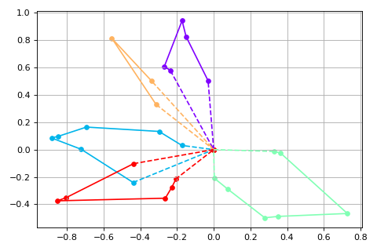
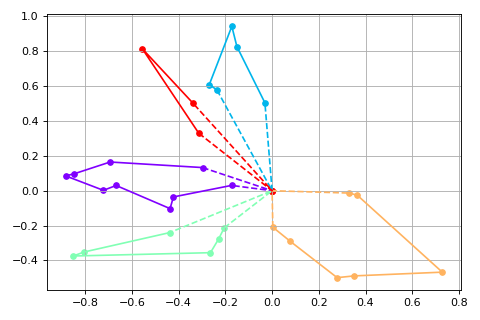
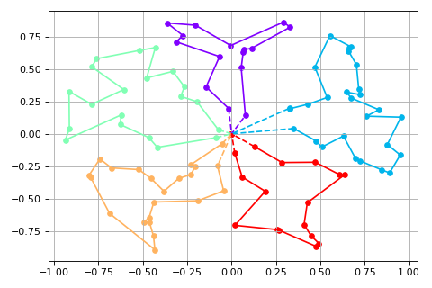
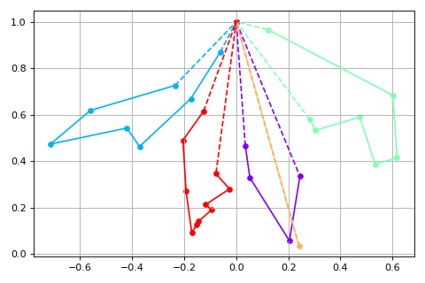
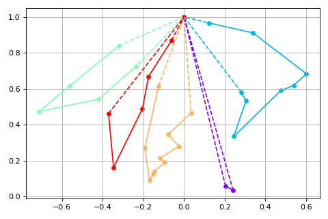
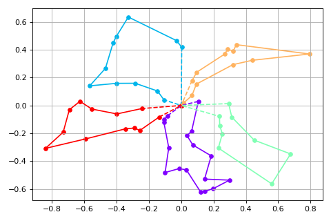
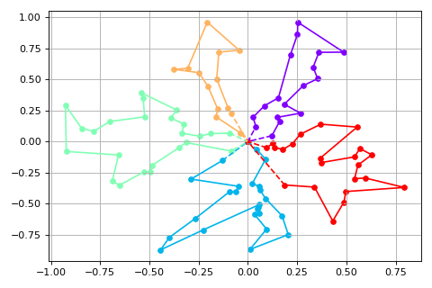
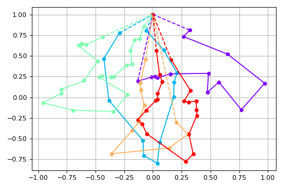
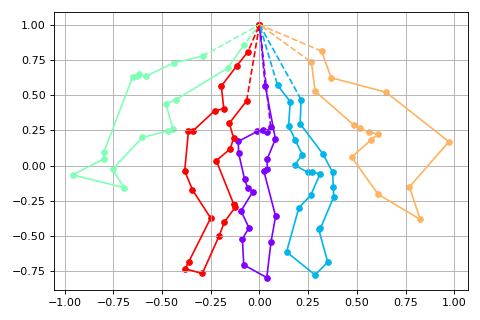

# Dynamic Insertion

This repository contains the Python implementation of the various heuristic methods described in the paper: ["A Sum-of-Squares Heuristic for a Dynamic Vehicle Routing Problem"](https://www.lancaster.ac.uk/staff/letchfoa/articles/dynamic-insertion.pdf).

## Dataset

The `dataset` folder includes a sample of 8 problem instances. The table below provides a summary of the characteristics of each instance and the number of customers served using the SoS insertion algorithm (with/without LS):

| Instance         | m   | D   | DL  | SoS | SoS with LS |
|------------------|-----|-----|-----|-----|-------------|
| instanceAUni.xy  | 5   | 2   | Uni | 28  | 30          |
| instanceBUni.xy  | 5   | 4   | Uni | 100 | 100         |
| instanceCUni.xy  | 5   | 2   | Uni | 29  | 30          |
| instanceDUni.xy  | 5   | 4   | Uni | 74  | 87          |
| instanceAExp.xy  | 5   | 2   | Exp | 47  | 61          |
| instanceBExp.xy  | 5   | 4   | Exp | 100 | 100         |
| instanceCExp.xy  | 5   | 2   | Exp | 25  | 25          |
| instanceDExp.xy  | 5   | 4   | Exp | 78  | 98          |

## Solution Plots

Below are the plots for each solution. For each problem instance, we illustrate two scenarios: one with the SoS insertion algorithm without any local search, and the other with the SoS insertion algorithm incorporating a local search that considers the SoS criterion as an objective.

### instanceAUni

| Without Local Search | With Local Search |
| --- | --- |
|  |  |

### instanceBUni

| Without Local Search | With Local Search |
| --- | --- |
|  |  |

### instanceCUni

| Without Local Search | With Local Search |
| --- | --- |
|  |  |

### instanceDUni

| Without Local Search | With Local Search |
| --- | --- |
|  |  |

### instanceAExp

| Without Local Search | With Local Search |
| --- | --- |
|  |  |

### instanceBExp

| Without Local Search | With Local Search |
| --- | --- |
|  |  |

### instanceCExp

| Without Local Search | With Local Search |
| --- | --- |
|  |  |

### instanceDExp

| Without Local Search | With Local Search |
| --- | --- |
|  |  |

## Problem Instance Format

Each problem instance follows the format below:

- The first line: Number of customers (always 100).
- The second line: ID of the depot and its coordinates.

Following that, there are 100 lines, each containing the following information for a customer: customer_ID X_coordinate Y_coordinate

## Contributors

- [Ahmed Kheiri](https://ahmedkheiri.github.io/)
- [Adam Letchford](https://www.lancaster.ac.uk/staff/letchfoa/)
- [Matthew Randall](https://www.lancaster.ac.uk/stor-i-student-sites/matthew-randall/)